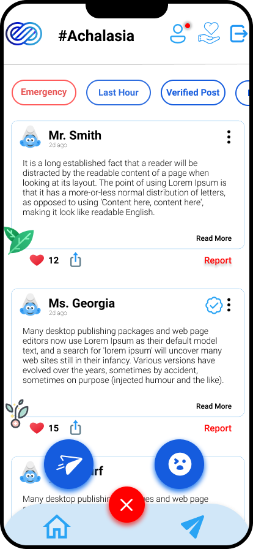

<h1 align="center"> Dreave </h1> <br>


<p align="center">
  <a href="https://github.com/woinbo/Dreave">
    
  </a>
</p>

<p align="center">
  An Application developed using flutter for Solution Challenge 2021.
  Made for the community of people suffering through  rare diseases.
</p>

<p align="center">
  <a href="https://itunes.apple.com/us/app/gitpoint/id1251245162?mt=8">
    
  </a>

  <a href="https://play.google.com/store/apps/details?id=com.gitpoint">
    
  </a>
</p>


## Table of Content 

- [Introduction](#introduction)
- [Features](#features)
- [Feedback](#feedback)
- [Contributors](#contributors)
- [Build Process](#build-process)

## Introduction

[](./Contributors.md)
[](https://gitter.im/Dreave-App/community?utm_source=badge&utm_medium=badge&utm_campaign=pr-badge)

We have made this application with the help of Flutter and FireBase. The Aim of this app is to build a strong community of people who are suffering from rare disease and feel left alone in the society.


**Available for both iOS and Android.**

<p align="center">
  
</p>


## Screenshots
<details>
     <summary> Click to expand </summary>
  
  
 Welcome Page               |  Login Page               | Signup Page               |  Forgot Password Page
:-------------------------:|:-------------------------:|:-------------------------:|:-------------------------:
||||

Home Page Sidebaar         |  Home Page       |   Home Page               |  Home Page
:-------------------------:|:-------------------------:|:-------------------------:|:-------------------------:
||||
  
  </details>


## Features

A few of the things you can do with Dreaven 

* Tell the symptoms of your disease and we will tell you which disease you are suffering through 
* Join the community where you can connect with people who are like you 
* Get advice from World Class Doctors, who work in WHO for human welfare
* Get the community support
* Give your personal views on the basis of your experience
* Donate organs or blood at time of emergency among the community people who are suffering from same rare disease


## Feedback

Feel free to send us feedback on [Survey-Form](https://7f0wxfgih3r.typeform.com/to/GnCAQY7G) or [file an issue](https://github.com/gitpoint/Dreave/issues/new). Feature requests are always welcome. If you wish to contribute, please take a quick look at the [guidelines](./CONTRIBUTING.md)!

If there's anything you'd like to chat about, please feel free to join our [Gitter chat](https://gitter.im/git-point)!

## Contributors

This project follows the  specification and is brought to you by these [awesome contributors](./Contributors.md).

## Build Process

**Step 1:**

Download or clone this repo by using the link below:

```
https://github.com/woinbo/Dreave
```

**Step 2:**

Go to project root and execute the following command in console to get the required packages: 

```console
flutter pub get 
```

**Step 3:**

To run this project:

```
flutter run
```


## Acknowledgments

Thanks to [Google](https://flutter.dev/) for supporting us with a [free Open Source License](https://flutter.dev/docs/resources/faq).


